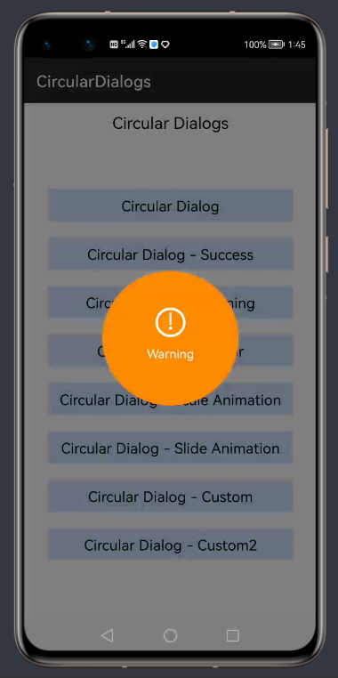

# CircularDialogs [](https://sonarcloud.io/dashboard?id=applibgroup_CircularDialogs) [](https://github.com/applibgroup/CircularDialogs/actions/workflows/main.yml)

CircularDialogs is custom dialog library to give user feedback about the common operations like Success, Warning and Errors, or make custom circular dialogs. It allows you to make beautiful dialogs with just few lines of code. You can choose from the predefined entry and exit animations. You can use lot of options as discussed below:

## Screenshots




## Source

Inspired from android library <https://github.com/HassanUsman/CircularDialogs>.

## Add Gradle dependency

1. For using CircularDialogs module in sample app, include the source code and add the below dependencies in entry/build.gradle to generate hap/support.har.

```
   dependencies {
      implementation project(':circulardialog')
      implementation fileTree(dir: 'libs', include: ['*.har'])
      testCompile 'junit:junit:4.12'
   }
```

2. For using CircularDialogs in separate application using har file, add the har file in the entry/libs folder and add the dependencies in entry/build.gradle file.

```
   dependencies {
      implementation fileTree(dir: 'libs', include: ['*.har'])
      testCompile 'junit:junit:4.12'
   }
```

3. For using CircularDialogs from a remote repository in separate application, add the below dependencies in entry/build.gradle file.

```
   dependencies {
      implementation 'dev.applibgroup:circulardialog:1.0.0'
      testCompile 'junit:junit:4.12'
   }
```

## Example

```
new CDialog(this).createAlert("You missed something",
                CDConstants.WARNING,                                    // Type of dialog
                CDConstants.LARGE)                                      //  size of dialog
                .setAnimation(CDConstants.SCALE_FROM_BOTTOM_TO_TOP)     //  Animation for enter/exit  
                .setDuration(2000)                                      // in milliseconds
                .setTextSize(CDConstants.LARGE_TEXT_SIZE)               // Text size
                .show();
```

## Options Available

Here are the different customizations that you can use to make things look different.

### Animations

Bottom and top can be exchanged as well as right to left.
Like scale you can also use slide animations, just replace `SCALE` with `SLIDE`.

```
     CDConstants.SCALE_FROM_BOTTOM_TO_TOP, 
     CDConstants.SCALE_FROM_RIGHT_TO_LEFT, 
     CDConstants.SLIDE_FROM_BOTTOM_TO_TOP
```

### Text Size

Text size can be `NORMAL_TEXT_SIZE`, `LARGE_TEXT_SIZE` or `EXTRA_LARGE_TEXT_SIZE`.

```
    setTextSize(CDConstants.NORMAL_TEXT_SIZE);
```

### Dialog Type

Right now only three types of dialogs are supported `CDConstants.SUCCESS`, `CDConstants.WARNING` and `CDConstants.ERROR`. See the top example for usage.

### Icons

You can use your own icons if you want. Here is the way :

```
    CDialog createAlert(String message, PixelMap icon, int alertType, int size); 
```

## Maintainer

[ HassanUsman](https://github.com/HassanUsman)
